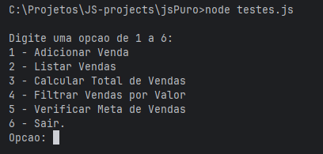
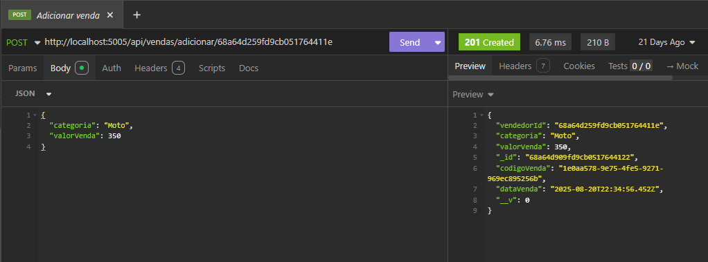

# Repositório FullStack com JavaScript e React

## Descrição
Este repositório reúne uma trilha de projetos práticos voltados para o desenvolvimento FullStack utilizando 
JavaScript e React. A proposta é evoluir gradualmente do básico ao intermediário, abordando:
- Construção de APIs e serviços backend com NodeJS.
- Integração com bancos de dados relacionais e não relacionais.
- Criação de interfaces modernas e responsivas com React.
- Princípios de autenticação, segurança, mensageria, testes, escalabilidade e boas práticas de arquitetura.

## Problema proposto
O desafio central é construir um sistema de gerenciamento interno de vendas, que permita acompanhar o desempenho 
de vendedores, metas e resultados. Entre os parâmetros e requisitos:
- Gestão de vendedores: cadastro, edição, exclusão lógica e listagem.
- Controle de vendas: inclusão, edição, exclusão e consultas por filtros.
- Metas personalizadas: definição por período (mensal, trimestral, etc.) e por categoria (bronze, prata e ouro).
- Relatórios:
    - Ranking de vendedores por período.
    - Total de vendas por categoria.
    - Evolução de metas e resultados.
- Usabilidade: interface web amigável para acompanhamento em tempo real.
- Escalabilidade: arquitetura que permita integrar novos módulos no futuro (ex.: comissões, notificações, integração 
com ERP).
- Boas práticas: uso de padrões REST, documentação da API, organização de código modular.

## Roadmap
Os projetos serão organizados em uma sequência iniciando do backend, passando pelo frontend e depois para a 
integração, cada um abordando novas camadas da stack. Abaixo estão listados os projetos com um link útil para 
navegação:
1. [Fundamentos JavaScript](./jsPuro/README.md) - Neste projeto exploro somente o NodeJS para construir o sistema de 
gerenciamento de vendas, armazenando os dados em memória. A imagem abaixo mostra como ficou o menu ainda em linha de comando. 

 
2. [API usando ExpressJS](./ApiJsExpress)  - Aqui uso o framework ExpressJS para construir uma API REST
para o sistema, utilizo MongoDB para armazenar os dados. A imagem abaixo mostra um teste via Insomnia para um 
endpoint de cadastro de venda:

3. Frontend com React - Interface web com dashboards de vendas e relatórios. Em desenvolvimento...